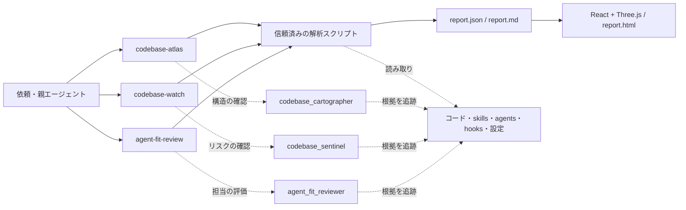

# Codebase Observatory

中規模コードベースの構造と、その開発を支えるスキル・エージェント・hooks・設定を見渡すローカルツールです。観測用3件と開発・設計・レビュー用12件の計15スキル、3つのカスタムエージェント、静的解析器、React + Three.jsのオフラインHTMLレポートを含みます。

特定のアプリへ組み込まず、任意の対象フォルダへ `--root` を向けて使う共通ツールとして提供します。案件固有の判断は対象リポジトリ側に置きます。対応する言語の解析範囲は後述のとおりで、すべての言語の実行関係を解析できるという意味ではありません。

## 同梱プロジェクト

| フォルダー | 内容 | 使い方 |
| --- | --- | --- |
| リポジトリ直下 | Codebase Observatory。コードベース・スキル・エージェントの構造を観測する共通ツール | このREADMEの「使い始める」以降 |
| [`ponytail/`](ponytail/) | DietrichGebert/ponytail のソース一式。既存の仕組みの再利用と、小さな実装を促すツール・スキル | [ponytailのREADME](ponytail/README.md) |
| [`design/`](design/) | design / System Atlas。リポジトリ・クラウド・データ・画面を共通モデルで探索するアプリ | [designのREADME](design/README.md) |
| [`kirodev/`](kirodev/) | 既存プロジェクト向けの Kiro 開発フロー、マネージャー・開発者・新任シニアのガイド、3つの再構成スキル | [Kiro開発フローガイド](kirodev/README.md) |

`ponytail/` は [DietrichGebert/ponytail のコミット 356918e](https://github.com/DietrichGebert/ponytail/tree/356918eba965ee1eac64bd3a7f0dd02108350de5) から取り込み、[元のMITライセンス](ponytail/LICENSE)を保持しています。`design/` は作成済みアプリのコミット `0cc11b8c8df13c2141aaa055ce2c39e42919812c` のソースです。どちらもこのリポジトリ内の通常のフォルダーとして保存しているため、クローンすると一緒に取得できます。

designを起動する場合は、Node.js 24以上でこのリポジトリのルートから次を実行します。

```bash
cd design
npm ci
npm run dev -- --host 127.0.0.1 --port 3100
```

## 使い始める

初回は下の「別環境への導入・再現」でセットアップします。導入後、Codexで対象フォルダを開いて、次のように依頼できます。

```text
$codebase-atlas で、このコードベースの構造とエージェント・スキルとのつながりを図で説明してください。

$codebase-watch で、セキュリティ、hooks、.js、.toml、.tolと前回からの変更を点検してください。

$agent-fit-review で、今のコードに合うスキル・エージェントを確認し、追加・統合・削除の候補を提案してください。
```

最初に読む資料:

- [このツールの代表的な流れを説明するHTML](examples/observatory.html)（ダウンロードしてブラウザーで開く）
- [説明図の入力JSON](examples/observatory.architecture.json) と [実コードとの対応](docs/architecture.md)
- [検証した範囲と公開用パッケージの確認](docs/publication-verification.md)
- [ブログの反映内容と写真の全文](docs/requirements-sources.md)
- [7リポジトリからの採用内容・固定版・ライセンス](third_party/README.md)

scanを実行すると、指定した出力先へ `report.html`、`report.json`、`report.md`、最大100回分の `history.json` を保存します。これらは作成時点のスナップショットです。説明用HTMLはこの共通ツール自身の構造を示し、任意の対象の全体マップはscanで生成します。

## 開発・設計・レビューに使う共通スキル

必要な用途のスキルを選びます。一つの依頼で全スキルを読む必要はありません。

|用途|呼び出すスキル|役割|
|---|---|---|
|モジュール設計|`$codebase-design`|公開契約、隠す複雑さ、変更の局所性を検討|
|用語と業務の概念|`$domain-modeling`|実コードと仕様から用語・不変条件・判断記録を整理|
|差分レビュー|`$code-review`|仕様への適合と具体的な不具合を確認|
|原因調査|`$diagnosing-bugs`|観測、仮説、最小の再現から原因を特定|
|TDD|`$tdd`|公開された振る舞いの失敗テストから実装|
|設計改善の探索|`$improve-codebase-architecture`|責務の分散や薄い抽象化の改善候補を比較|
|UIの設計|`$frontend-design`|既存ブランドと目的に合う文字組み・配置・操作状態|
|資料の品質確認|`$consulting-slide-review`|主張・図表・用語・レイアウトと機械チェック|
|独立作業の分担|`$astra-orchestrator`|担当範囲と完了条件を決め、結果を統合|
|小さく実装|`$ponytail`|既存コード・標準機能・導入済み依存を先に活用|
|過剰設計のレビュー|`$ponytail-review`|動作を保てる重複・不要な仕組みの削減候補|
|説明する図|`$archify`|構造・処理・呼出順・データ・状態を単独HTMLへ|

```text
$ponytail で、既存の仕組みを使ってこの機能を最小限の変更で実装してください。

$ponytail-review で、現在の差分に不要な抽象化や新規依存がないか確認してください。

$archify で、このコードの代表的なリクエスト処理を日本語の説明図にしてください。

$consulting-slide-review で、この提案資料の主張と図表をレビューしてください。
```

スキルの知識は共通で使い、対象側の仕様、用語、テンプレート、承認済みの依頼を優先します。既存の `improve-codebase-architecture` の明示呼出ポリシーを保持しているため、これは `$` で指定してください。その他は通常の自動選択も可能です。案件に同名スキルがある場合はその定義を保護し、必要に応じて実際に選択されたパスを確認します。

## 外部リポジトリから取り込んだもの

|出典|この共通版での採用|
|---|---|
|[Matt Pocock Skills](https://github.com/mattpocock/skills/tree/main/skills)|上記の設計・用語・レビュー・診断・TDD・改善探索の6スキル。固定人数の委譲や一律の語彙制限を調整|
|[Anthropic Skills](https://github.com/anthropics/skills)|frontend-designを既存UIに適用しやすく調整。文書系は既存スキルを利用|
|[OpenAI Plugins](https://github.com/openai/plugins)|構造図・Three.jsの判断とスキル品質の観点を参考に、既存スキルと形式検査器へ反映|
|[Carnot](https://github.com/carnot-tech/consulting-pptx-skill)|規約・62型の参考資料・HTML/PPTX検査器・HTML生成補助を資料レビュー用に配置|
|[Astra/Luna Orchestrator](https://github.com/donvito/codex-astra-luna-orchestrator)|Objective / Scope / Context / Constraints / Deliverable / Acceptance の委譲契約と任意のモデル設定例|
|[Ponytail](https://github.com/DietrichGebert/ponytail)|再利用の順序と過剰設計レビューを採用。仕様・安全性・可読性を保つ方針へ調整|
|[Archify](https://github.com/tt-a1i/archify)|安定版v2.16.0の生成・検証・Viewerを同梱。日本語とローカル根拠の手順、外部フォントを使わない出力へ調整|

固定したコミットと改変ファイルは [出典記録](third_party/README.md) に記載しています。これは選んだスキル・実行補助の共通化であり、7件のプラグイン一式を導入する構成ではありません。

Astra/Lunaを選ぶ場合の [設定例](examples/astra-luna.config.toml) は任意です。現在のモデルを既定で引き継ぎ、全体設定を書き換えません。Ponytailの常時注入Hookは追加していません。スライド補助の生成器はHTML/PDF向けで、編集可能PPTXの作成には既存のPresentationsスキルを使います。

Archifyは対象のコードを自動で完全解析するものではなく、根拠を読んで作成する代表図です。通常は `ARCHIFY_UPDATE_CHECK_DISABLED=1` を付けて同梱Node CLIを実行します。公開GitHubを持たない対象の出典は隣接する根拠表へ記載します。日本語の本文・ラベルに対応しますが、Viewerの操作UIには英語が残ります。

## スキル・エージェント・コードの関係

|スキル: 再利用する手順|エージェント: 担当する役割|成果物|
|---|---|---|
|`codebase-atlas`|`codebase_cartographer`|入口・責務・依存・影響範囲と2D/3Dマップ|
|`codebase-watch`|`codebase_sentinel`|セキュリティ兆候、設定/Hookの点検、差分|
|`agent-fit-review`|`agent_fit_reviewer`|維持・拡張・追加・統合・廃止前の確認案|



スキルが親の進め方を決め、親がレポートを生成します。独立した評価や文脈・権限の分離が役立つ場合に専門エージェントを使い、親が結果を統合します。小さな確認を毎回3担当へ配る必要はありません。判断基準と専門知識はスキル側に集め、エージェント定義は呼出先・入出力・読み取り権限を記載する短い形にしています。モデルと推論量は親の設定を引き継ぎ、実際の権限には親セッションの設定も適用されます。

`AGENTS.md` は作業指示、`.codex/agents/*.toml` はカスタムエージェント、`SKILL.md` はスキル、`agents/openai.yaml` はスキルの表示情報です。`openai.yaml`を独立したエージェントと数えません。Hookは指定されたイベントで具体的なスクリプトを起動し、TOML/JSON/YAML等の設定は権限や適用範囲、依存を決めます。

## 共通の判断基準と案件ごとの補足

3スキルは [共通作業方針](skills/codebase-atlas/references/common-workflow.md) を読みます。過剰設計を避ける2行を [AGENTS.md](AGENTS.md) にも記載しました。

```text
オーバーエンジニアリングを禁止する。要求を満たす最小の変更を選び、不要な抽象化・依存・仕組みを追加しない。
検証は変更の影響に必要な最小範囲から行う。フルテストは広い影響・失敗・明示要件がある場合に絞り、変更や新たな懸念がなければ繰り返さない。
```

対象の `AGENTS.md` と現行仕様・設計を判断の根拠とし、固有の手順がある場合だけ `codebase-atlas-local`、`codebase-watch-local`、`agent-fit-review-local` を追加で読みます。配置例は `.agents/skills/codebase-watch-local/SKILL.md`。これは明示した命名規約で、Codexによる同名定義の自動上書きではありません。共通手順を保ち、固有の用語・合格条件・検証コマンド等を補足します。

既存文書で足りない部分には [案件の判断基準の記入例](examples/project-context.md) と [RDR/ADRの記入例](examples/decision-record.md) を使えます。重要な判断を変えるときに記録し、長い作業は既存planへ進捗と検証結果を残します。すべての変更で一式の文書を作る運用にはしません。

監視スキルは個人情報保護について、公開前の検査、CIでの検出、混入後の対応を点検します。これは作業手順の追加であり、PIIの網羅検出やcommit/PRを強制停止する機構の導入ではありません。記事との対応と写真の原文は [要件の出典](docs/requirements-sources.md) に記載しています。

## コマンド

このディレクトリから実行します。`obs` はPython 3.11以上を選び、このツールの `.venv` があれば優先します。

```bash
# 1回点検。初回は基準値を作り、次回から差分を作る
./obs scan --root /absolute/path/to/repository

# 出力先を指定。対象内では .observatory / reports 配下を使う
./obs scan --root /absolute/path/to/repository --out /absolute/path/to/repository/.observatory

# 開発中の変更監視。停止は Ctrl-C
./obs watch --root /absolute/path/to/repository --interval 30

# CI: high以上の兆候で終了1。読取不完全は終了2
./obs scan --root /absolute/path/to/repository --fail-on high

# 既存のレポート2件を比較
./obs compare /path/to/before/report.json /path/to/after/report.json

# 明示した共通定義フォルダも読む（複数指定可能）
./obs scan --root /absolute/path/to/repository --context-root /absolute/path/to/shared/agents

# 生成HTML1枚だけを127.0.0.1に配信するプレビュー
.venv/bin/python scripts/preview.py /absolute/path/to/report.html
```

watchはファイル変更があったときだけレポートと履歴を更新します。HTML側を再読み込みするか、「レポートを開く」から更新されたJSONを選んでください。終了0は指定した観測条件の通過、1は閾値以上の兆候、2は入力/読取/解析の不備、130はCtrl-Cによる停止です。常駐監視やCodexの定期実行を開始する処理は、今回の導入には含めていません。定期実行を依頼した場合の手順は `codebase-watch` に用意してあります。

基準値には対象、除外、上限を記録します。違う対象や上限は比較を拒否します。`.gitignore`、既定の除外、解析器が変わった場合は削除/解消を判定せず、次の観測で新しい条件を基準にします。行移動は見かけの新規/解消になることがあります。

## 解析するもの

- JS/TS/JSX/TSX: TypeScript構文木。import、export、require、文字列のdynamic import、ローカルtsconfigのextends/paths、HTML挿入や文字列実行の兆候。
- Python: 標準AST。import、相対import、動的実行・逆直列化、shell=Trueの兆候。
- HTML: script/link等の読み込み先。
- skills/agents: 必須項目、スキル名による参照、エージェント名の記載、同梱スクリプトや文書、同名/同一手順。
- hooks/設定: `.codex/hooks.json`、inline hooksを含むTOML、`.husky`、既定のGit hooks（sample除外）、package scripts、YAML/JSON、`.js/.mjs/.cjs`、`.tol`等。
- セキュリティ: 秘密値候補、秘密鍵の埋め込み、TLS検証無効、権限迂回指定、curl等の取得結果をシェルへ直結する処理。

グラフの実線はimport等、点線はスキル・文書上の参照です。同梱や記載の事実は「実際に実行した」という証拠ではありません。2Dでは矢印の向き、3Dではまとまりを確認し、右の詳細でファイル:行をたどれます。ファイル表示は160項目/650関係に絞り、全件は検索・ページ付き一覧とJSONに残します。

## 観測範囲と限界

既定では最大20,000ファイル、1ファイル512 KiB、合計64 MiB。必要なら `--max-files`、`--max-bytes`、`--max-total-bytes` で変更できます。`.gitignore`は入れ子のリポジトリも考慮します。`node_modules`、`.venv`、`.git`本体、生成レポートなどは走査対象から除きます。`.git/hooks`の実ファイルだけは別途取得します。

`.env`実値や認証ファイル、鍵ファイル、シンボリックリンク先は自動で読みません。シンボリックリンクの内容が必要なら、その実体ディレクトリを明示的に `--context-root` へ追加してください。worktree共通hooksや `core.hooksPath`、ホーム設定、プラグインの設定等は対象ルートの外に存在し得ます。スキルの追加点検手順で対象を特定します。

対象のコード、package scripts、hooks、設定を実行しません。JS解析にはこのツール自身のTypeScriptパーサーを使います。レポートへはファイル位置・行数・ハッシュ・関係・ルールの説明を保存し、ソース本文や秘密の値を複製しません。HTMLのデータは文字としてエスケープし、外部通信をCSPで禁止しています。レポート自体には内部構造やパスが含まれるので、共有先は用途に応じて選んでください。

静的解析だけでは認証/認可、到達性、動的呼び出し、最新CVE、スキルの実使用率、最適性を証明できません。自動の適合性欄は構文・参照・明示語句に基づく候補です。専門エージェントは該当する実ファイルを確認して意味を評価します。参照がないだけの定義には「廃止前の利用確認」と表示します。無条件の自動削除はありません。

追加の除外は対象ルートの `.observatory.toml` に記載します。設定は単なるデータとして読み込みます。

```toml
[scan]
exclude = ["generated/**", "fixtures/large/**"]
```

## 別環境への導入・再現

必要環境: macOS/Linux、Node.js 20以上、Python 3.11以上。Codexスキルとして使う場合はCodexも必要です。ネットワークは依存の導入時と任意の外部監査時に使います。通常のscanとHTML閲覧はオフラインです。

```bash
git clone https://github.com/tamagobolo/nyonyonyo.git
cd nyonyonyo
python3 -m venv .venv
.venv/bin/python -m pip install -r requirements.txt
npm ci --ignore-scripts
npm run build
npm test

# スキルの形式・到達するMarkdown参照を確認
.venv/bin/python scripts/check_skills.py

# 個人用。CODEX_HOME未設定なら ~/.codex/skills と ~/.codex/agents
.venv/bin/python scripts/install.py --scope user

# 指定プロジェクトだけで発見できる形にする場合
.venv/bin/python scripts/install.py --scope project --project /absolute/path/to/repository
```

インストーラーは名前が衝突する既存ファイルを保護します。スキルはこのツールのディレクトリへのシンボリックリンク、エージェントはTOMLのコピーです。このディレクトリを移動する場合はリンク先も見直してください。`config.toml`の全体設定、既存hooks、他のエージェント/スキルは変更しません。

登録15スキルの配布元と既存の配置先を先に確認し、不足や衝突があれば書き込み前に停止します。`--dry-run` で配置予定だけを表示できます。Codexでの発見結果は `scripts/verify_codex.py` で確認できます。新たなスキルは次のターンから利用可能です。

## 設定形式の出典

2026-09-10に [OpenAIのカスタムエージェント仕様](https://learn.chatgpt.com/docs/agent-configuration/subagents)、[スキル仕様](https://learn.chatgpt.com/docs/build-skills)、[Hooks仕様](https://learn.chatgpt.com/docs/hooks)を確認しています。実装は [React createRoot](https://react.dev/reference/react-dom/client/createRoot) と [Three.js](https://threejs.org/manual/en/creating-a-scene.html)を利用します。実行環境のCodex CLIは0.153.4で確認しました。

運用方針には [AI-Native な開発の実践に向けて（メルカリ、2026-06-30）](https://engineering.mercari.com/blog/entry/20260630-b22667b4d6/) と、提供された写真の要望を反映しています。

## 配布内容とライセンス

このリポジトリは共通ツールのソース、ビルド済みViewer、15スキル、3エージェント、導入・検証スクリプト、公開用の説明図を含みます。生成される解析レポートとPython/Nodeの実行環境はローカルで管理します。

第三者のスキル・コード・資産のライセンス原文と改変範囲は [third_party](third_party/README.md) を参照してください。独自に作成した部分のライセンスは未指定です。
